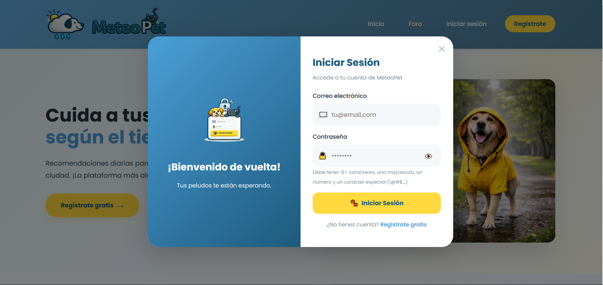
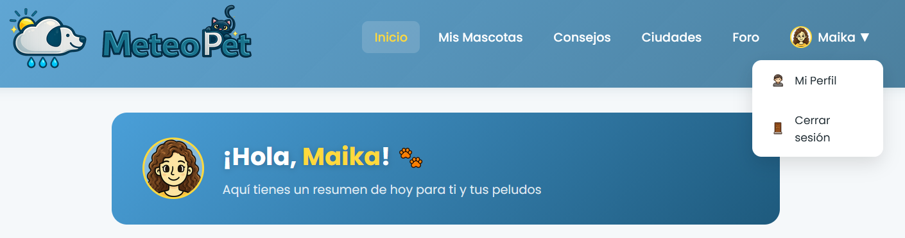
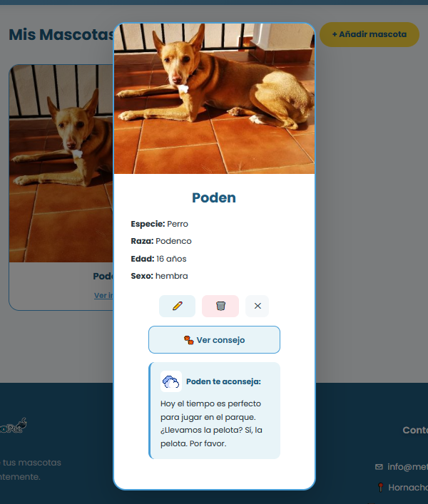
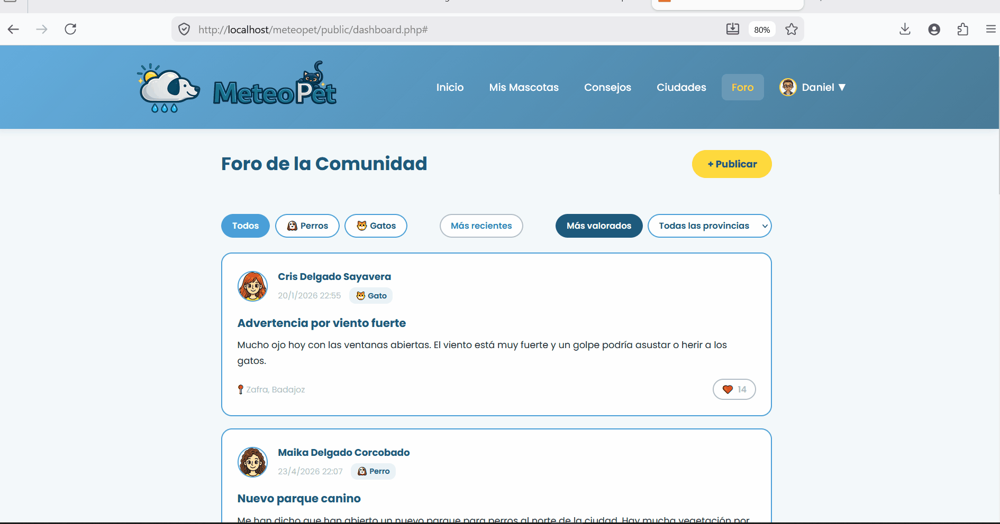
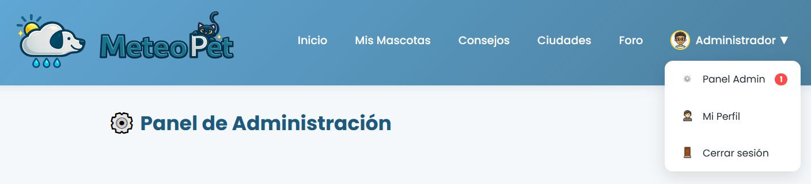
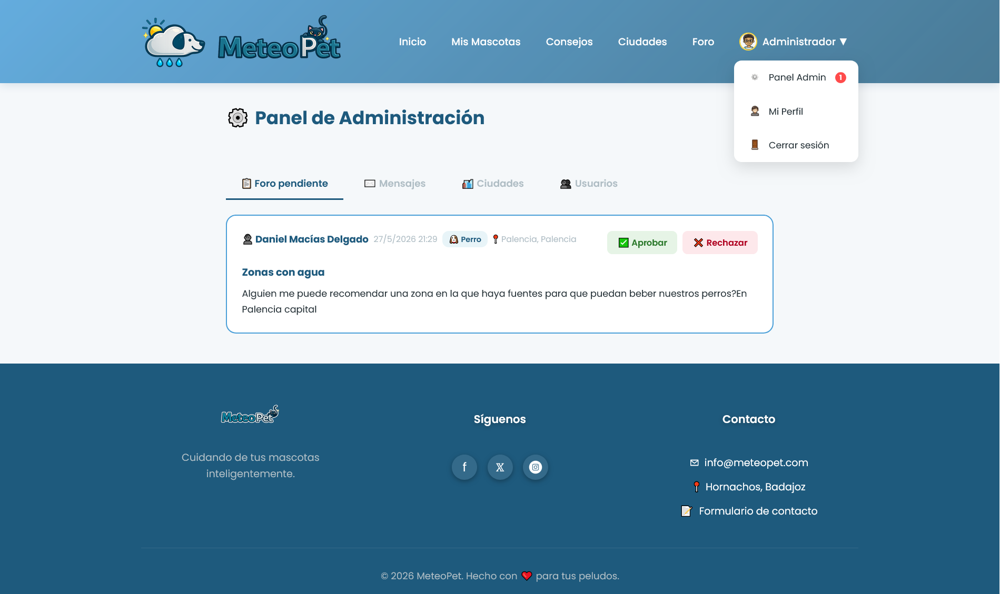
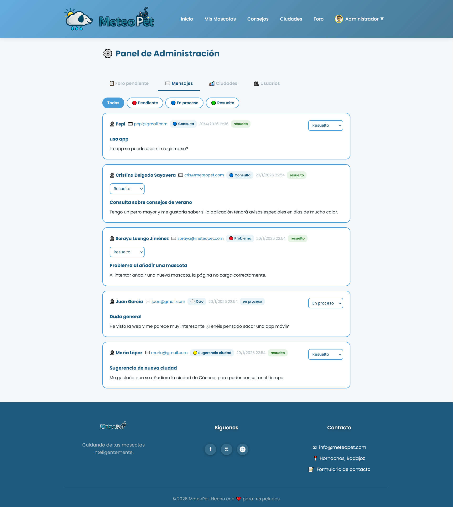
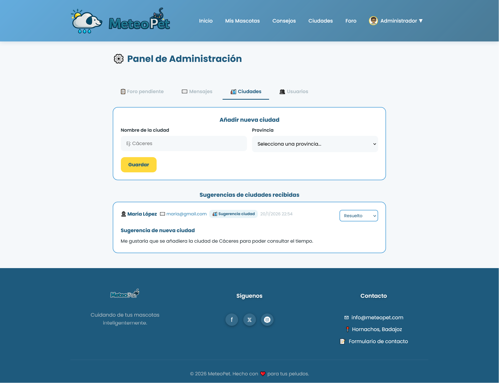
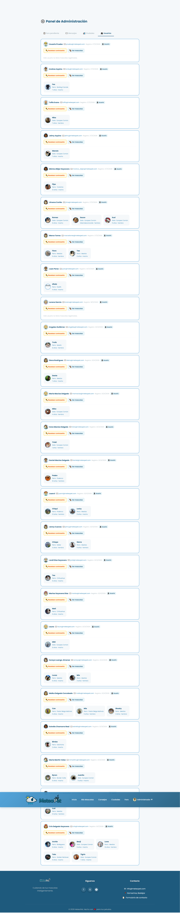
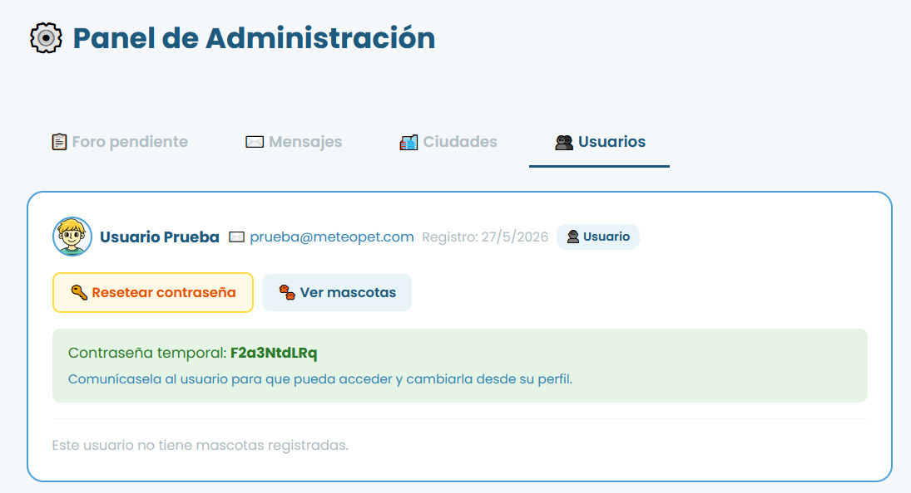

# Manual de Usuario 🐾

## MeteoPet — Tu app del tiempo para mascotas

Bienvenido/a al manual de MeteoPet. Aquí te explicamos todo lo que puedes hacer en la app, paso a paso y sin complicaciones. 🌦️

---

## Índice

- [Manual de Usuario 🐾](#manual-de-usuario-)
  - [MeteoPet — Tu app del tiempo para mascotas](#meteopet--tu-app-del-tiempo-para-mascotas)
  - [Índice](#índice)
  - [1. ¿Qué es MeteoPet?](#1-qué-es-meteopet)
  - [2. Cómo acceder a la app](#2-cómo-acceder-a-la-app)
  - [3. Crear una cuenta](#3-crear-una-cuenta)
  - [4. Iniciar sesión](#4-iniciar-sesión)
  - [5. El dashboard — tu zona personal](#5-el-dashboard--tu-zona-personal)
  - [6. Mis Mascotas 🐾](#6-mis-mascotas-)
    - [Añadir una mascota](#añadir-una-mascota)
    - [Ver la ficha de una mascota](#ver-la-ficha-de-una-mascota)
  - [7. Consejos del tiempo 🌦️](#7-consejos-del-tiempo-️)
  - [8. Ciudades Favoritas 📍](#8-ciudades-favoritas-)
    - [Añadir una ciudad](#añadir-una-ciudad)
    - [Cambiar la ciudad principal](#cambiar-la-ciudad-principal)
  - [9. El Foro 💬](#9-el-foro-)
    - [Leer publicaciones](#leer-publicaciones)
    - [Publicar un aviso](#publicar-un-aviso)
  - [10. Mi Perfil 👤](#10-mi-perfil-)
    - [Cambiar tu avatar](#cambiar-tu-avatar)
    - [Cambiar tu nombre](#cambiar-tu-nombre)
    - [Cambiar tu contraseña](#cambiar-tu-contraseña)
    - [Eliminar tu cuenta](#eliminar-tu-cuenta)
  - [11. Panel de Administración ⚙️](#11-panel-de-administración-️)
    - [📋 Foro pendiente](#-foro-pendiente)
    - [✉️ Mensajes](#️-mensajes)
    - [🏙️ Ciudades](#️-ciudades)
    - [👥 Usuarios](#-usuarios)

---

## 1. ¿Qué es MeteoPet?

MeteoPet es una app web que te ayuda a cuidar mejor a tus peludos según el tiempo que hace en tu ciudad. Cada día el tiempo es diferente, y eso les afecta igual que a ti — con calor sufren más, con tormenta se asustan, con frío necesitan más abrigo...

MeteoPet consulta el tiempo real de tu ciudad y te da consejos personalizados para cada una de tus mascotas. Además, puedes compartir avisos con otros humanos de mascotas en el foro de la comunidad. 

---

## 2. Cómo acceder a la app

Abre tu navegador y ve a:
http://localhost/meteopet/public/

Verás la página principal de MeteoPet con información sobre la app, las últimas publicaciones del foro y el tiempo actual de tu zona. No hace falta estar registrado para ver esto.

---

## 3. Crear una cuenta

Para disfrutar de todo lo que ofrece MeteoPet necesitas registrarte. Es gratis y muy sencillo:

1. Pulsa el botón **"Regístrate"** del menú superior o el botón **"Crear Cuenta Gratis"**
2. Rellena el formulario con tu nombre, email y contraseña
3. Elige tu **provincia** y tu **ciudad principal** — esta es la ciudad que MeteoPet usará para darte los consejos del tiempo
4. Elige un **avatar** de la galería — ¡el que más te guste!
5. Pulsa **"Crear cuenta"**

> 💡 La contraseña debe tener al menos 8 caracteres, una mayúscula, un número y un carácter especial (como `!`, `@`, `#`...)

---

## 4. Iniciar sesión

Si ya tienes cuenta, pulsa **"Iniciar sesión"** en el menú y escribe tu email y contraseña. ¡Y ya estás dentro! 🎉

---

## 5. El dashboard — tu zona personal

Una vez dentro verás tu **dashboard**, que es tu zona personal en MeteoPet. Desde aquí puedes:

- Ver el **saludo** con tu nombre y avatar
- Consultar el **tiempo actual** de tu ciudad principal
- Acceder rápidamente a todas las secciones de la app con los **accesos rápidos**

En el menú superior tienes todos los apartados disponibles. En la esquina derecha verás tu nombre con una flechita — púlsalo para acceder a tu perfil, al panel de admin (si eres administradora) o para cerrar sesión.

---

## 6. Mis Mascotas 🐾

Aquí puedes registrar a todos tus peludos. Cada mascota tiene su propio perfil con foto, nombre, especie, raza, edad y sexo.

### Añadir una mascota

1. Pulsa el botón **"+ Añadir mascota"**
2. Rellena los datos de tu peludo
3. Sube una foto si quieres (es opcional)
4. Pulsa **"Guardar mascota"**

### Ver la ficha de una mascota

Pulsa sobre la tarjeta de cualquier mascota para ver su ficha completa. Desde ahí puedes:

- **Editar** sus datos con el botón ✏️
- **Eliminar** la mascota con el botón 🗑️
- Ver un **consejo personalizado** para ella según el tiempo de hoy pulsando **"🐾 Ver consejo"**

---

## 7. Consejos del tiempo 🌦️

Esta es la sección estrella de MeteoPet. Aquí verás:

- El tiempo actual de tu ciudad (temperatura, descripción e icono animado)
- Un **consejo personalizado** para cada una de tus mascotas según cómo está el tiempo hoy

Los consejos cambian según el tiempo del momento — no es lo mismo un día de tormenta que un día de calor extremo. MeteoPet lo tiene en cuenta. ⛈️☀️❄️

---

## 8. Ciudades Favoritas 📍

Puedes guardar varias ciudades en tus favoritas — útil si viajas con tus mascotas o tienes una segunda residencia.

### Añadir una ciudad

1. Escribe el nombre en el buscador
2. Selecciona la ciudad en los resultados
3. Pulsa **"+ Añadir"**

### Cambiar la ciudad principal

Tu ciudad principal es la que MeteoPet usa para darte los consejos. Para cambiarla, pulsa el botón ⭐ que aparece junto a cualquiera de tus ciudades favoritas.

> ⚠️ No puedes eliminar tu ciudad principal. Primero establece otra como principal y luego borra la que quieras.

---

## 9. El Foro 💬

El foro es el espacio de la comunidad. Aquí puedes leer y publicar avisos relacionados con el tiempo y tus mascotas — consejos, alertas meteorológicas, experiencias...

### Leer publicaciones

Puedes filtrar las publicaciones por:
- **Especie** (todos, perros o gatos)
- **Provincia**
- **Orden** (más recientes o más valorados)

También puedes dar ❤️ like a las publicaciones que te gusten.

### Publicar un aviso

1. Pulsa **"+ Publicar"**
2. Escribe el título y el contenido de tu aviso
3. Selecciona la especie, provincia y ciudad
4. Pulsa **"Enviar aviso"**

> 💡 Las publicaciones no aparecen de inmediato — primero las revisa el administrador y las aprueba. ¡No te preocupes si no las ves enseguida!

---

## 10. Mi Perfil 👤

Desde tu perfil puedes:

### Cambiar tu avatar
Elige el que más te guste de la galería y pulsa **"Guardar"**. Tu nuevo avatar aparecerá también en el menú.

### Cambiar tu nombre
Edita tu nombre y pulsa **"Guardar"**.

### Cambiar tu contraseña
Escribe tu contraseña actual, la nueva y confírmala. Recuerda que debe cumplir los requisitos de seguridad.

### Eliminar tu cuenta
Si decides irte (¡esperemos que no! 😢) puedes eliminar tu cuenta desde la sección **"¿Nos abandonas?"**. Ten en cuenta que se borrarán todos tus datos, mascotas y publicaciones. Esta acción no se puede deshacer.

---

## 11. Panel de Administración ⚙️

> Esta sección solo es visible para los usuarios con rol de **administrador**.

El panel de admin tiene cuatro pestañas:

### 📋 Foro pendiente
Aquí aparecen todas las publicaciones que los usuarios han enviado y están esperando revisión. Puedes **aprobarlas** ✅ para que sean visibles en el foro o **rechazarlas** ❌.

### ✉️ Mensajes
Gestiona los mensajes de contacto que llegan a través del formulario. Puedes cambiar su estado entre **pendiente**, **en proceso** y **resuelto**, y filtrarlos por estado.

### 🏙️ Ciudades
Añade nuevas ciudades al catálogo de la app. Solo tienes que escribir el nombre y seleccionar la provincia — MeteoPet busca las coordenadas automáticamente. También puedes ver las sugerencias de ciudades que han enviado los usuarios por el formulario de contacto.

### 👥 Usuarios
Ve la lista de todos los usuarios registrados. Puedes ver sus mascotas y, si es necesario, **resetear su contraseña** — se genera una contraseña temporal que le puedes comunicar para que pueda acceder y cambiarla desde su perfil.

---

*Manual de usuario de MeteoPet — Cristina Delgado Sayavera — Junio 2026* 🐾