<div align="center">


**I.E.S. Suárez de Figueroa**

---

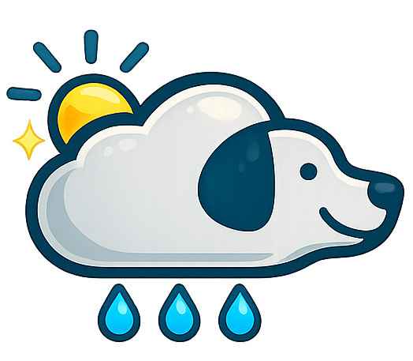


---

# MeteoPet

### Aplicación web de consejos para mascotas según el tiempo

---

|                           |                                                                                          |
| ------------------------- | ---------------------------------------------------------------------------------------- |
| **Ciclo Formativo**       | Desarrollo de Aplicaciones Web (DAW)                                                     |
| **Centro educativo**      | I.E.S. Suárez de Figueroa                                                                |
| **Autora**                | Cristina Delgado Sayavera                                                                |
| **Tutor**                 | José Andrés Paredes Arribas                                                              |
| **Fecha de presentación** | Junio 2026                                                                               |
| **Repositorio**           | [Ver en GitHub](https://github.com/suarezfigueroa/2025-2026_CristinaDelgado/tree/master) |

</div>

## 2. Índice

- [MeteoPet](#meteopet)
    - [Aplicación web de consejos para mascotas según el tiempo](#aplicación-web-de-consejos-para-mascotas-según-el-tiempo)
  - [2. Índice](#2-índice)
  - [3. Introducción](#3-introducción)
  - [4. Objetivos del proyecto](#4-objetivos-del-proyecto)
    - [Objetivos funcionales](#objetivos-funcionales)
    - [Objetivos técnicos](#objetivos-técnicos)
  - [5. Justificación del proyecto](#5-justificación-del-proyecto)
    - [5.1 Análisis de mercado](#51-análisis-de-mercado)
    - [5.2 Vinculación con los contenidos del Ciclo Formativo](#52-vinculación-con-los-contenidos-del-ciclo-formativo)
  - [6. Recursos utilizados](#6-recursos-utilizados)
    - [6.1 Entornos de desarrollo](#61-entornos-de-desarrollo)
    - [6.2 Lenguajes de programación](#62-lenguajes-de-programación)
    - [6.3 Utilidades](#63-utilidades)
  - [7. Tecnologías de desarrollo](#7-tecnologías-de-desarrollo)
    - [PHP](#php)
    - [API REST](#api-rest)
    - [MySQL](#mysql)
    - [SPA (Single Page Application)](#spa-single-page-application)
    - [JavaScript vanilla](#javascript-vanilla)
    - [HTML5 y CSS3](#html5-y-css3)
    - [OpenWeatherMap API](#openweathermap-api)
  - [8. Diseño del proyecto](#8-diseño-del-proyecto)
    - [8.1 Diseño de la base de datos](#81-diseño-de-la-base-de-datos)
      - [Diagrama E/R](#diagrama-er)
      - [Modelo Relacional](#modelo-relacional)
    - [8.2 Carga de datos inicial](#82-carga-de-datos-inicial)
    - [8.3 Diseño de la interfaz de usuario](#83-diseño-de-la-interfaz-de-usuario)
    - [8.4 Roles de la aplicación](#84-roles-de-la-aplicación)
    - [8.5 Usuarios de prueba](#85-usuarios-de-prueba)
  - [9. Lógica y codificación del proyecto](#9-lógica-y-codificación-del-proyecto)
    - [9.1 Principales procesos](#91-principales-procesos)
      - [Sistema SPA (Single Page Application)](#sistema-spa-single-page-application)
      - [Integración con la API del tiempo](#integración-con-la-api-del-tiempo)
      - [Sistema de consejos personalizados](#sistema-de-consejos-personalizados)
    - [9.2 Aspectos relevantes de la implementación](#92-aspectos-relevantes-de-la-implementación)
      - [Validación de datos](#validación-de-datos)
      - [Control de acceso](#control-de-acceso)
      - [Sistema de carpetas](#sistema-de-carpetas)
  - [10. Despliegue web del proyecto](#10-despliegue-web-del-proyecto)
    - [10.1 Requisitos hardware](#101-requisitos-hardware)
    - [10.2 Servidores utilizados](#102-servidores-utilizados)
    - [10.3 Seguridad](#103-seguridad)
    - [10.4 Instalación en local](#104-instalación-en-local)
  - [11. Manual de usuario](#11-manual-de-usuario)
  - [12. Conclusiones y aspectos a mejorar 🐾](#12-conclusiones-y-aspectos-a-mejorar-)
    - [Conclusiones](#conclusiones)
    - [Aspectos a mejorar y líneas futuras](#aspectos-a-mejorar-y-líneas-futuras)
  - [13. Bibliografía](#13-bibliografía)
  - [Anexos](#anexos)
    - [Anexo I — Script SQL de la base de datos](#anexo-i--script-sql-de-la-base-de-datos)
    - [Anexo II — Diagrama E/R y Modelo Relacional](#anexo-ii--diagrama-er-y-modelo-relacional)
      - [Diagrama Entidad-Relación](#diagrama-entidad-relación)
      - [Modelo Relacional](#modelo-relacional-1)

## 3. Introducción

MeteoPet nació de la combinación de mis dos grandes pasiones: la meteorología y mis animales. 🌦️🐱🐶

Soy geógrafa con especialización en climatología, así que el tiempo atmosférico es algo que me ha fascinado desde pequeña. Me encanta observar el cielo, entender por qué llueve o truena, hacer seguimientos... Es algo que llevo muy dentro. 🌩️

Y luego están ellos: Tato, Luna, Benji y Tigrin. 🐶🐶🐱🐱 Cualquiera que conviva con animales sabe que el tiempo les afecta igual que a nosotros, aunque a veces no le prestamos atención. Tato ladra cuando hay tormenta porque tiene miedo, Benji se esconde. Con el calor, Tato busca su rincón del verano y Tigrin y Benji ya no se suben a la cama a acurrucarse a dormir conmigo. Luna está menos activa cuando el sol aprieta... ☀️ Cada uno tiene sus cosas, y como parte de la familia una aprende a leerlos. ❤️

De esa observación del día a día surgió la idea: ¿y si hubiera una app que te dijera cómo cuidar mejor a tus mascotas según el tiempo que hace hoy en tu ciudad?

MeteoPet es exactamente eso. Una aplicación web que consulta el tiempo real de tu ciudad y te da consejos personalizados para cada una de tus mascotas, según su especie y las condiciones meteorológicas del momento. Además, incluye un foro donde sus humanos pueden compartir avisos y experiencias con su comunidad. 🌍💬

Va dirigida a cualquier persona que quiera lo mejor para sus animales y que, como yo, sea un poco friki del tiempo y del bienestar de sus peludos.

[⬆️ Volver al índice](#2-índice)

## 4. Objetivos del proyecto

El objetivo principal de MeteoPet es ofrecer a los humanos de mascotas una herramienta útil, sencilla y simpática que les ayude a cuidar mejor a sus peludos según el tiempo que hace cada día en su ciudad. 🐾🌦️

### Objetivos funcionales

- Consultar el tiempo real de la ciudad principal en la que se encuentre el usuario usando la API de OpenWeatherMap. 🌍
- Mostrar consejos personalizados para cada mascota según su especie y las condiciones meteorológicas del momento.
- Permitir registrar y gestionar el perfil de cada mascota (nombre, especie, raza, edad, foto...).
- Gestionar ciudades favoritas y elegir una como ciudad principal para los consejos.
- Ofrecer un foro comunitario donde los usuarios puedan compartir avisos y experiencias con otros humanos de mascotas.
- Incluir un panel de administración para moderar el foro, gestionar mensajes de contacto y usuarios.

### Objetivos técnicos

- Desarrollar una aplicación web completa siguiendo una arquitectura SPA (página única) en el dashboard, cargando las vistas de forma dinámica sin recargar la página.
- Aplicar los conocimientos del ciclo de DAW: PHP, MySQL, JavaScript, HTML y CSS, sin usar frameworks externos.
- Trabajar con una API externa real (OpenWeatherMap) para obtener datos meteorológicos en tiempo real.
- Diseñar y gestionar una base de datos relacional en MySQL con múltiples tablas relacionadas.
- Implementar un sistema de autenticación con sesiones PHP y control de roles (usuario y administrador).
- Crear una interfaz responsive que funcione correctamente tanto en escritorio como en móvil.

[⬆️ Volver al índice](#2-índice)

## 5. Justificación del proyecto

### 5.1 Análisis de mercado

La idea de MeteoPet responde a una necesidad real y cotidiana: la mayoría de las personas que conviven con animales no disponen de una herramienta específica que les indique cómo afecta el tiempo a sus mascotas y qué pueden hacer para cuidarlas mejor según las condiciones meteorológicas del día.

Existen aplicaciones del tiempo como **Weather.com**, **AEMET** o **AccuWeather** que informan sobre el clima, pero ninguna lo conecta con el cuidado de mascotas. Por otro lado, hay apps de mascotas como **Dogo** o **11Pets** que gestionan perfiles y recordatorios veterinarios, pero tampoco tienen en cuenta el tiempo atmosférico. MeteoPet cubre ese hueco: combina ambos mundos en una sola aplicación. 🐾🌦️

A nivel de comunidad, existen foros generalistas como **Forocoches** o grupos de Facebook, pero no hay una plataforma específica donde los humanos de mascotas puedan compartir avisos relacionados con el tiempo en su zona. MeteoPet incluye ese foro comunitario como valor añadido.

### 5.2 Vinculación con los contenidos del Ciclo Formativo

MeteoPet integra de forma práctica los conocimientos trabajados a lo largo del ciclo de Desarrollo de Aplicaciones Web:

- **Desarrollo web en entorno cliente:** toda la lógica del dashboard está desarrollada en JavaScript vanilla, incluyendo la arquitectura SPA, la gestión de vistas dinámicas, el uso de `fetch()` para consumir las APIs y la manipulación del DOM con templates y delegación de eventos.

- **Desarrollo web en entorno servidor:** el backend está desarrollado en PHP con MySQLi, implementando una API REST propia con los métodos GET, POST, PUT y DELETE, gestión de sesiones, control de roles y subida de archivos.

- **Diseño de interfaces web:** la interfaz está diseñada desde cero con CSS puro, sin frameworks, aplicando diseño responsive, variables CSS, animaciones y una identidad visual propia con paleta de colores, tipografía y logotipo.

- **Despliegue de aplicaciones web:** la aplicación está estructurada para su despliegue en un servidor web con PHP y MySQL, con separación entre el código público y la configuración del servidor.

- **Digitalización aplicada a los sectores productivos:** el proyecto conecta con el sector de las mascotas y la meteorología, dos ámbitos en los que la digitalización tiene cada vez más presencia, ofreciendo una solución tecnológica a una necesidad cotidiana real.

- **Proyecto Intermodular:** MeteoPet es el resultado de aplicar de forma conjunta todos los módulos del ciclo en un proyecto completo, desde el diseño de la base de datos hasta la interfaz final.

[⬆️ Volver al índice](#2-índice)

## 6. Recursos utilizados

### 6.1 Entornos de desarrollo

- **Visual Studio Code** — editor de código principal, usado para escribir y organizar todos los archivos del proyecto (PHP, JS, HTML, CSS, Markdown)
- **XAMPP** — servidor local con Apache y MySQL, usado para desarrollar y probar la aplicación en local antes del despliegue
- **phpMyAdmin** — interfaz visual para gestionar la base de datos MySQL, crear tablas y hacer consultas durante el desarrollo
- **Git / GitHub** — control de versiones y repositorio remoto del proyecto

### 6.2 Lenguajes de programación

- **PHP** — backend y API REST propia. Gestiona las peticiones del servidor, la lógica de negocio, las sesiones de usuario, el control de roles y la comunicación con la base de datos.
- **MySQL** — base de datos relacional. Almacena todos los datos de la aplicación: usuarios, mascotas, ciudades, publicaciones del foro, mensajes de contacto y consejos.
- **JavaScript (vanilla)** — lógica del cliente. Gestiona la arquitectura SPA del dashboard, carga las vistas de forma dinámica, consume la API propia y la API del tiempo, y maneja toda la interacción con el usuario.
- **HTML5** — estructura de todas las páginas y vistas de la aplicación.
- **CSS3** — estilos visuales de la aplicación. Diseño responsive, variables CSS, animaciones y la identidad visual completa sin usar ningún framework externo.

### 6.3 Utilidades

**APIs:**
- **OpenWeatherMap API** — API del tiempo usada para obtener las condiciones meteorológicas en tiempo real según las coordenadas de la ciudad del usuario. [https://openweathermap.org/api](https://openweathermap.org/api) 🌦️

**Recursos gráficos:**
- **Stitch (IA)** — herramienta de inteligencia artificial usada como inspiración para el diseño visual de la aplicación. [https://stitch.withgoogle.com](https://stitch.withgoogle.com)
- **ChatGPT (DALL·E)** — generación de imágenes e ilustraciones de la aplicación con IA. [https://chatgpt.com](https://chatgpt.com)
- **Flaticon** — iconos animados usados para representar los estados del tiempo en la aplicación. [https://www.flaticon.com](https://www.flaticon.com)
- **Canva** — retoques y ajustes de algunas imágenes. [https://www.canva.com](https://www.canva.com)
- **Paint 3D** — edición puntual de imágenes.
- **Google Fonts (Poppins)** — tipografía principal de la aplicación. [https://fonts.google.com](https://fonts.google.com)

**Documentación:**
- **draw.io** — herramienta online para crear los diagramas de la base de datos y la arquitectura del proyecto. [https://app.diagrams.net](https://app.diagrams.net)

[⬆️ Volver al índice](#2-índice)

## 7. Tecnologías de desarrollo

### PHP
PHP es un lenguaje de programación que se ejecuta en el servidor. Se encarga de recibir las peticiones del navegador, procesarlas y devolver una respuesta. En MeteoPet se usa para construir toda la API propia y gestionar las sesiones de usuario.

Elegí PHP porque es el lenguaje del servidor que hemos trabajado a lo largo del ciclo, está perfectamente integrado con MySQL y no requiere instalar herramientas adicionales para funcionar con XAMPP.

### API REST
Una API REST es una forma de comunicación entre el navegador y el servidor. En lugar de recargar la página entera, el navegador hace peticiones pequeñas al servidor (GET para pedir datos, POST para enviar, PUT para actualizar y DELETE para eliminar) y el servidor responde con datos en formato JSON.

En MeteoPet toda la comunicación entre el frontend y el backend se hace a través de una API REST propia, lo que permite que el dashboard funcione como una SPA sin recargar la página.

### MySQL
MySQL es un sistema de base de datos relacional. Los datos se organizan en tablas que se relacionan entre sí mediante claves. En MeteoPet se almacena toda la información de la aplicación: usuarios, mascotas, ciudades, publicaciones del foro, consejos y mensajes de contacto.

Se eligió MySQL porque es el sistema de base de datos que hemos trabajado en el ciclo y está incluido en XAMPP, lo que facilita el desarrollo en local.

### SPA (Single Page Application)
Una SPA es una aplicación web que carga una sola página y va cambiando el contenido de forma dinámica sin recargar el navegador. En MeteoPet el dashboard funciona como una SPA: el navbar y el footer siempre están visibles y solo cambia la zona central según la sección que el usuario seleccione.

Se eligió esta arquitectura para dar una experiencia más fluida y moderna al usuario, evitando las recargas de página que hacen la navegación más lenta.

### JavaScript vanilla
JavaScript es el lenguaje de programación del navegador. En MeteoPet se usa para toda la lógica del cliente: cargar las vistas dinámicamente, hacer peticiones a la API propia y a OpenWeatherMap, gestionar los modales, los formularios y la interacción con el usuario.

Se eligió JavaScript puro, sin frameworks como React o Vue, porque permite demostrar un conocimiento sólido del lenguaje en sí y porque para el tamaño de este proyecto no era necesario añadir esa complejidad extra.

### HTML5 y CSS3
HTML5 es el lenguaje con el que se estructura el contenido de las páginas web y CSS3 es el que define su aspecto visual. En MeteoPet se han usado para construir todas las páginas, vistas y modales de la aplicación, con un diseño responsive que se adapta a cualquier tamaño de pantalla.

Se eligió CSS puro sin frameworks como Bootstrap para tener control total sobre el diseño y aplicar una identidad visual propia y coherente.

### OpenWeatherMap API
OpenWeatherMap es una API externa que proporciona datos meteorológicos en tiempo real de cualquier ciudad del mundo. En MeteoPet se usa para obtener la temperatura, la descripción del tiempo y el código meteorológico de la ciudad principal del usuario, y así mostrar los consejos adecuados para sus mascotas.

Se eligió porque tiene una capa gratuita suficiente para este proyecto, está muy bien documentada y es una de las APIs del tiempo más usadas a nivel mundial.

[⬆️ Volver al índice](#2-índice)

## 8. Diseño del proyecto

### 8.1 Diseño de la base de datos

#### Diagrama E/R
📎 [Ver Anexo II — Diagrama E/R y Modelo Relacional](#anexo-ii--diagrama-er-y-modelo-relacional)

#### Modelo Relacional
📎 [Ver Anexo II — Diagrama E/R y Modelo Relacional](#anexo-ii--diagrama-er-y-modelo-relacional)

---

### 8.2 Carga de datos inicial

El script con los datos iniciales de la base de datos (DML) está disponible en los anexos:
📎 [Ver Anexo I — Script SQL](#anexo-i-script-sql)

---

### 8.3 Diseño de la interfaz de usuario

El diseño de MeteoPet se desarrolló directamente en código, usando **Stitch IA** como inspiración visual para definir la paleta de colores, la distribución de los elementos y el estilo general de la interfaz.

La aplicación tiene una estética alegre y cercana, pensada para que cualquier persona se sienta cómoda usándola.

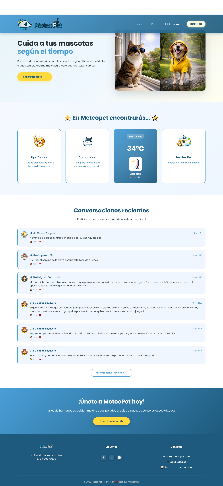

---

**Paleta de colores:**
| Color     | Uso                                         |
| --------- | ------------------------------------------- |
| `#1E5A7D` | Azul principal — navbar, títulos, botones   |
| `#4A9FD8` | Azul secundario — bordes, degradados        |
| `#FFD93D` | Amarillo — botones de acción, hover, badges |
| `#FFA726` | Naranja — hover de botones amarillos        |
| `#F5F8FA` | Gris claro — fondo general del dashboard    |

**Tipografía:** Google Fonts — **Poppins** (pesos 400, 500, 600 y 700)

---

**Navbar y navegación:**
El navbar es fijo y cambia de opacidad al hacer scroll. En móvil se convierte en un menú desplegable. El dropdown del perfil da acceso al perfil, al panel de admin y al cierre de sesión.


---

**Sistema SPA — navegación sin recargar:**
El dashboard carga las vistas de forma dinámica sin recargar la página, dando una experiencia fluida y moderna.


---

**Modales de acceso:**
El registro y el login se gestionan desde modales sin salir de la página. El registro incluye selector de provincia, ciudad y avatar.


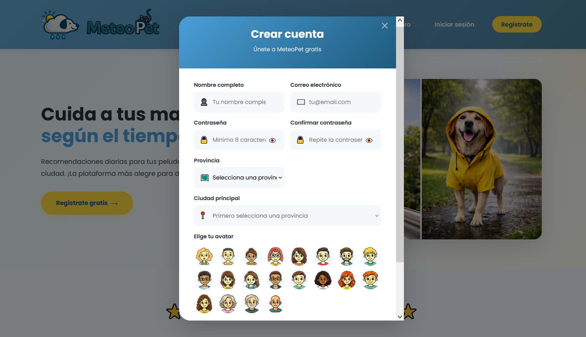

---

**Vista de inicio:**
Saludo personalizado con el nombre y avatar del usuario, tarjeta del tiempo actual y accesos rápidos a todas las secciones.

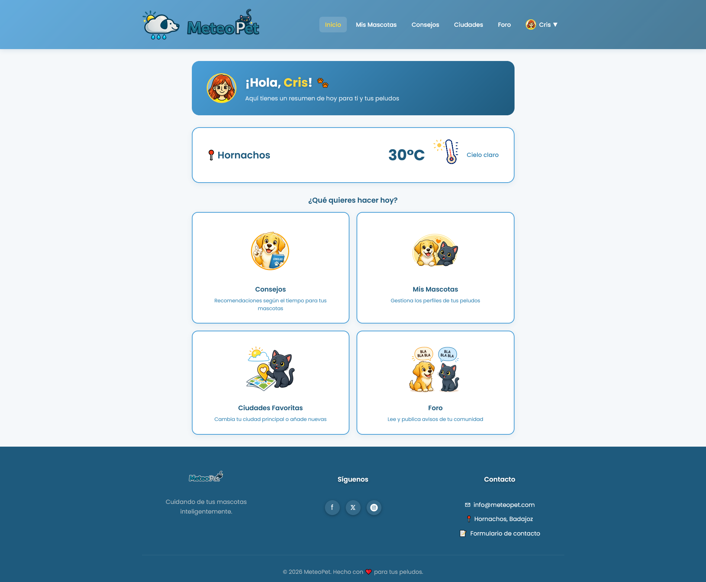

---

**Mis Mascotas:**
Galería de mascotas con tarjetas. Al pulsar una tarjeta se abre la ficha completa con la opción de ver un consejo personalizado según el tiempo del día.

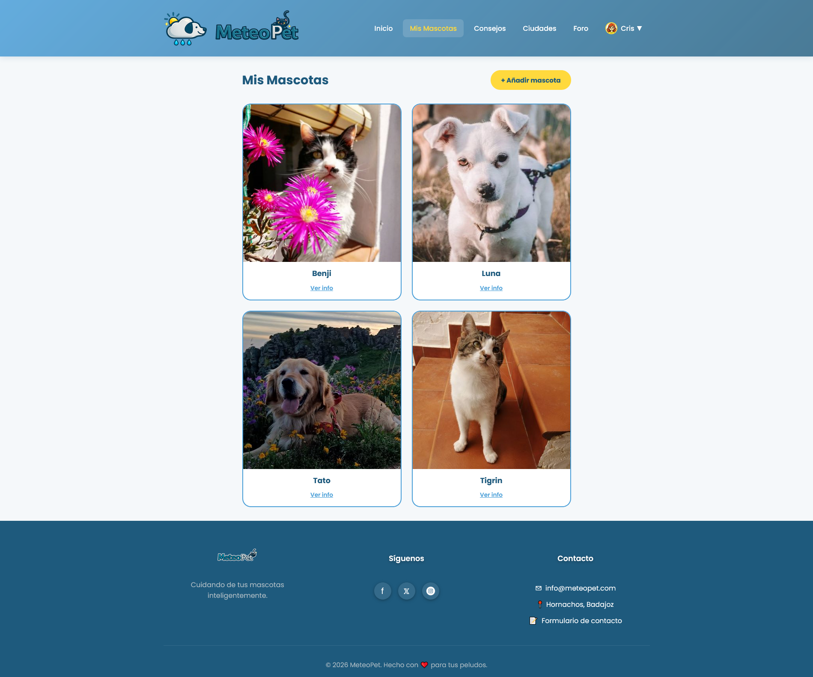

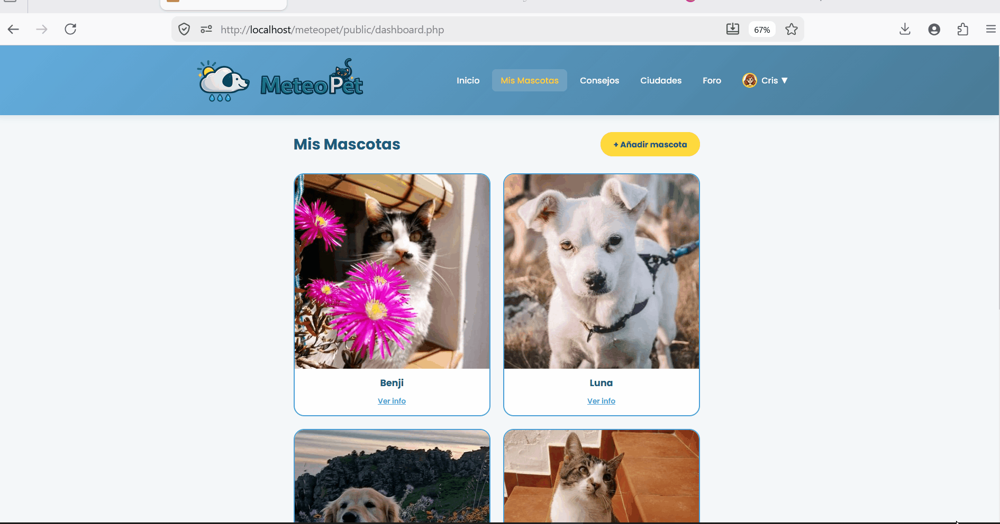

---

**Consejos del tiempo:**
Tarjetas de consejos personalizadas por mascota con el icono animado del tiempo actual. Alternan entre azul y amarillo.

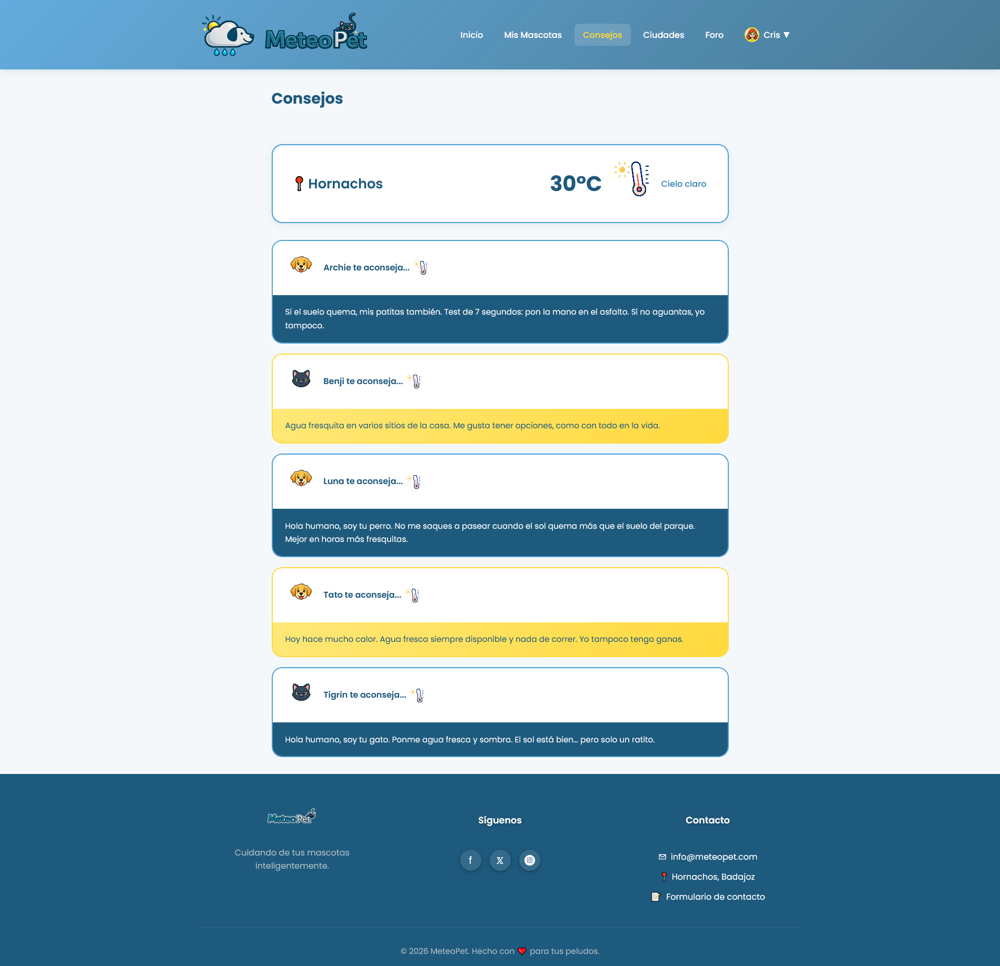

---

**Ciudades favoritas:**
Buscador con resultados en tiempo real y gestión de la ciudad principal.

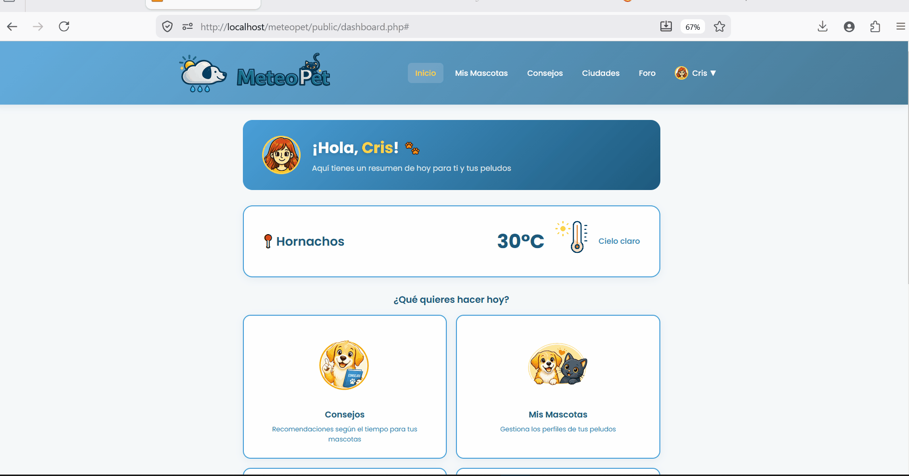

---

**Foro de la comunidad:**
Publicaciones con filtros por especie, provincia y orden. Los usuarios pueden dar like a las publicaciones que les gusten.

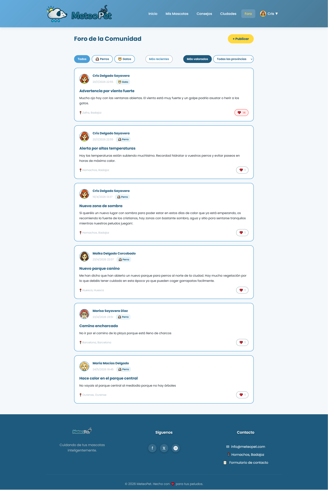


---

**Mi Perfil:**
Cambio de avatar, nombre y contraseña. Zona de peligro para eliminar la cuenta.

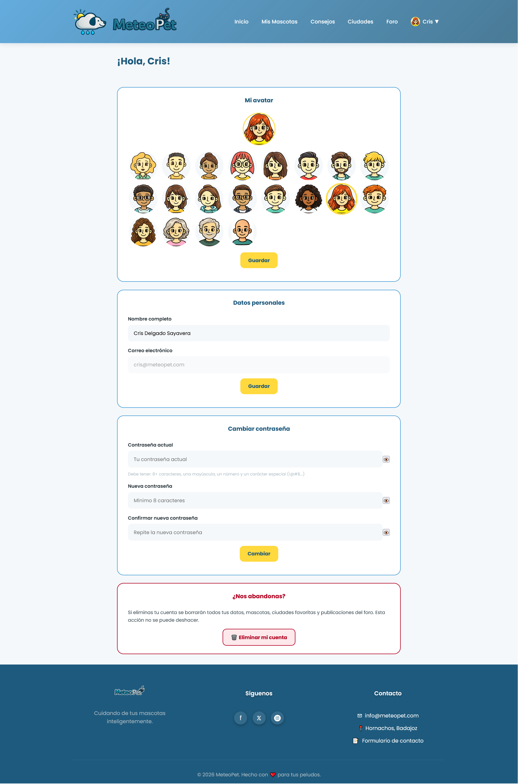

---

**Panel de administración:**
Gestión completa del foro, mensajes, ciudades y usuarios desde cuatro pestañas.


### 8.4 Roles de la aplicación

MeteoPet tiene dos tipos de usuario:

**Usuario registrado**
Es el usuario estándar de la aplicación. Puede:
- Ver y editar su perfil y avatar
- Registrar, editar y eliminar sus mascotas
- Consultar los consejos del tiempo para sus mascotas
- Gestionar sus ciudades favoritas y elegir una como principal
- Leer y publicar avisos en el foro (pendientes de aprobación)
- Dar likes a las publicaciones del foro
- Enviar mensajes de contacto

**Administrador**
Tiene acceso a todo lo del usuario registrado más el panel de administración. Puede:
- Aprobar o rechazar publicaciones del foro antes de que sean visibles
- Gestionar los mensajes de contacto y cambiar su estado (pendiente, en proceso, resuelto)
- Añadir nuevas ciudades al catálogo
- Ver la lista de usuarios registrados y resetear contraseñas

---

### 8.5 Usuarios de prueba

Para probar la aplicación se han creado los siguientes usuarios:

| Rol           | Email               | Contraseña   |
| ------------- | ------------------- | ------------ |
| Administrador | admin@meteopet.com  | Admin1234!   |
| Usuario       | prueba@meteopet.com | Usuario1234! |

[⬆️ Volver al índice](#2-índice)

## 9. Lógica y codificación del proyecto

### 9.1 Principales procesos

#### Sistema SPA (Single Page Application)

El dashboard de MeteoPet funciona como una SPA. Esto significa que cuando el usuario navega entre secciones (Inicio, Mis Mascotas, Consejos...) el navegador no recarga la página entera — solo cambia el contenido central.

El proceso es el siguiente:

1. El usuario pulsa un enlace del navbar
2. El JS intercepta el click y llama a `cargarVista(nombre)`
3. La función hace un `fetch()` al archivo HTML de la vista correspondiente
4. El contenido se inyecta en el elemento `main` con `innerHTML`
5. Se llama a la función `init` de esa vista (por ejemplo `initForo()`) que registra los escuchadores y carga los datos desde la API

```javascript
async function cargarVista(nombre) {
    const contenido = document.querySelector('#contenido-principal');
    const res = await fetch(rutas[nombre] + '?t=' + Date.now());
    const html = await res.text();
    contenido.innerHTML = html;

    if (nombre == 'foro') initForo();
    else if (nombre == 'mis-mascotas') initMisMascotas();
    // ...
}
```

Los templates de las tarjetas (mascotas, publicaciones, consejos...) están en `dashboard.php` porque al cargar las vistas con `innerHTML` los elementos de dentro no pueden contener templates propios.

---

#### Integración con la API del tiempo

MeteoPet usa la API de OpenWeatherMap para obtener el tiempo real de la ciudad principal del usuario. El proceso es:

1. Al cargar una vista que necesita el tiempo (Inicio, Consejos), el JS consulta `api/sesion.php` para obtener las coordenadas de la ciudad principal del usuario
2. Con esas coordenadas hace una petición a OpenWeatherMap
3. La respuesta incluye el código meteorológico, la temperatura y la humedad
4. Con esos tres datos se determina el tipo de tiempo (tormenta, lluvia, frío, calor...) y se elige el icono animado correspondiente

```javascript
async function cargarTiempoInicio(ciudad, lat, lon) {
    const url = URL_TIEMPO + '?lat=' + lat + '&lon=' + lon +
        '&appid=' + API_KEY_TIEMPO + '&units=metric&lang=es';
    const res = await fetch(url);
    const datos = await res.json();

    const temp = Math.round(datos.main.temp);
    const humedad = datos.main.humidity;
    const codigo = datos.weather[0].id;
    // ...
}
```

---

#### Sistema de consejos personalizados

Los consejos son el núcleo de MeteoPet. El proceso para generarlos es:

1. Se obtiene el tiempo actual de la ciudad del usuario (temperatura, humedad y código meteorológico)
2. Con esos datos se determina el tipo de tiempo mediante la función `convertirCodigoATipo()`
3. Se consulta `api/consejos.php?tipo_tiempo=X` que devuelve los consejos almacenados en la base de datos para cada especie y ese tipo de tiempo
4. Se muestra un consejo aleatorio por cada mascota del usuario, evitando repetir el mismo consejo hasta haberlos mostrado todos

```javascript
function convertirCodigoATipo(codigo, temp, humedad) {
    if (codigo >= 200 && codigo < 300) return 'tormenta';
    if (codigo >= 300 && codigo < 400) return 'llovizna';
    if (temp >= 28) return 'calor';
    if (temp <= 8) return 'frio';
    if (humedad >= 70) return 'humedad';
    return 'estable';
    // ...
}
```

---

### 9.2 Aspectos relevantes de la implementación

#### Validación de datos

La validación se realiza en dos niveles:

**En el frontend (JavaScript):** antes de enviar cualquier formulario se comprueban los campos obligatorios, el formato del email y los requisitos de la contraseña (mínimo 8 caracteres, una mayúscula, un número y un carácter especial). Esto da una respuesta inmediata al usuario sin necesidad de esperar al servidor.

```javascript
function validarPassword(password) {
    const errores = [];
    if (password.length < 8) errores.push('al menos 8 caracteres');
    if (!/[A-Z]/.test(password)) errores.push('una mayúscula');
    if (!/[0-9]/.test(password)) errores.push('un número');
    if (!/[!@#$%^&*()_+\-=\[\]{};':"\\|,.<>\/?]/.test(password)) errores.push('un carácter especial');
    return errores;
}
```

**En el backend (PHP):** aunque el frontend ya valida, el servidor vuelve a comprobar todos los datos antes de guardarlos en la base de datos. Esto es necesario porque cualquiera podría saltarse el frontend y hacer peticiones directas a la API.

---

#### Control de acceso

MeteoPet tiene tres niveles de control de acceso:

**Páginas públicas** (`index.html`, `foro_publico.html`): accesibles para cualquier visitante sin necesidad de estar registrado.

**Dashboard de usuario** (`dashboard.php`): al entrar, PHP comprueba si hay una sesión activa. Si no la hay, redirige automáticamente a `index.html`.

```php
session_start();
if (!isset($_SESSION["usuario_id"])) {
    header("Location: index.html");
    exit;
}
```

**API REST**: cada endpoint PHP comprueba que existe una sesión válida antes de devolver o modificar datos. Los endpoints del panel de administración comprueban además que el rol del usuario sea `administrador`.

```php
if (!isset($_SESSION['usuario_id']) || $_SESSION['usuario_rol'] !== 'administrador') {
    enviarError(403, 'Acceso denegado');
}
```

---

#### Sistema de carpetas

```
METEOPET/
├── readme.md                   ← documentación principal
├── img/                        ← imágenes y GIFs de la documentación
└── public/                     ← código de la aplicación
    ├── index.html              ← landing page pública
    ├── foro_publico.html       ← foro público sin autenticación
    ├── dashboard.php           ← shell del dashboard autenticado
    ├── .env                    ← variables de entorno
    ├── .htaccess               ← configuración del servidor Apache
    ├── api/                    ← endpoints de la API REST
    │   ├── admin.php
    │   ├── avatares.php
    │   ├── ciudades_catalogo.php
    │   ├── ciudades.php
    │   ├── consejos.php
    │   ├── contacto.php
    │   ├── foro_publico.php
    │   ├── foro.php
    │   ├── mascotas.php
    │   ├── perfil.php
    │   ├── registro.php
    │   └── sesion.php
    ├── auth/                   ← autenticación
    │   ├── login_process.php
    │   └── logout.php
    ├── config/                 ← configuración de la base de datos
    │   └── db.php
    ├── assets/
    │   ├── css/
    │   │   ├── styles.css      ← estilos de la landing
    │   │   ├── dashboard.css   ← estilos del shell
    │   │   ├── foro_publico.css
    │   │   └── vistas/         ← un CSS por cada vista
    │   │       ├── admin.css
    │   │       ├── ciudades.css
    │   │       ├── consejos.css
    │   │       ├── foro.css
    │   │       ├── inicio.css
    │   │       ├── mascotas.css
    │   │       └── perfil.css
    │   ├── js/
    │   │   ├── dashboard.js    ← JS del shell
    │   │   ├── foro_publico.js
    │   │   ├── index.js        ← JS de la landing
    │   │   └── vistas/         ← un JS por cada vista
    │   │       ├── admin.js
    │   │       ├── ciudades.js
    │   │       ├── consejos.js
    │   │       ├── foro.js
    │   │       ├── inicio.js
    │   │       ├── mascotas.js
    │   │       └── perfil.js
    │   └── img/                ← imágenes de la app
    │       ├── avatares/
    │       ├── tiempo/         ← iconos animados del tiempo
    │       └── ui/             ← iconos e imágenes de la interfaz
    ├── uploads/                ← fotos subidas por los usuarios
    │   └── mascotas/
    └── vistas/                 ← vistas parciales del dashboard
        ├── admin.html
        ├── ciudades.html
        ├── consejos.html
        ├── foro.html
        ├── inicio.html
        ├── mis-mascotas.html
        └── perfil.html
```

[⬆️ Volver al índice](#2-índice)

## 10. Despliegue web del proyecto

MeteoPet está desarrollada y probada en un entorno local. A continuación se detallan los requisitos y pasos necesarios para su instalación y despliegue.

### 10.1 Requisitos hardware

Para ejecutar la aplicación en local no se necesita un equipo potente. Los requisitos mínimos son:

- Procesador: cualquier procesador moderno de doble núcleo
- RAM: mínimo 4 GB
- Espacio en disco: mínimo 500 MB libres
- Conexión a internet: necesaria para cargar la API del tiempo (OpenWeatherMap) y la tipografía (Google Fonts)

### 10.2 Servidores utilizados

El proyecto se ejecuta en local usando **XAMPP**, que incluye:

- **Apache** — servidor web que sirve los archivos PHP y HTML
- **MySQL** — base de datos donde se almacenan todos los datos de la aplicación
- **PHP 8+** — lenguaje del servidor

El proyecto se coloca dentro de la carpeta `htdocs` de XAMPP:

```
C:/xampp/htdocs/meteopet/
```

Y se accede desde el navegador en:

```
http://localhost/meteopet/public/
```

### 10.3 Seguridad

Aunque el proyecto está en local, se han aplicado las siguientes medidas de seguridad:

- **Control de sesiones PHP:** el dashboard solo es accesible si hay una sesión activa. Si no la hay, redirige automáticamente a la landing.
- **Control de roles:** el panel de administración comprueba que el usuario tenga rol de administrador antes de devolver cualquier dato.
- **Prepared statements:** todas las consultas a la base de datos usan sentencias preparadas con MySQLi para evitar inyecciones SQL.
- **Validación doble:** los datos se validan tanto en el frontend (JavaScript) como en el backend (PHP) antes de guardarse.
- **Archivo `.env`:** las credenciales de la base de datos y la API key de OpenWeatherMap se guardan en un archivo `.env` separado del código, que no se sube al repositorio.
- **Archivo `.htaccess`:** configuración del servidor Apache para gestionar las rutas de la aplicación.

### 10.4 Instalación en local

Para instalar MeteoPet en local desde cero:

1. Instalar **XAMPP** desde [https://www.apachefriends.org](https://www.apachefriends.org)
2. Clonar o descargar el repositorio del proyecto
3. Copiar la carpeta del proyecto dentro de `htdocs`:

```
C:/xampp/htdocs/meteopet/
```

4. Importar la base de datos en **phpMyAdmin**:
   - Abrir `http://localhost/phpmyadmin`
   - Crear una base de datos llamada `meteopet`
   - Importar el archivo SQL del Anexo I
5. Configurar el archivo `.env` con las credenciales de la base de datos y la API key de OpenWeatherMap
6. Iniciar Apache y MySQL desde el panel de control de XAMPP
7. Abrir el navegador en `http://localhost/meteopet/public/`

[⬆️ Volver al índice](#2-índice)

## 11. Manual de usuario

El manual de usuario completo está disponible en un documento independiente:

📎 [Ver Manual de Usuario](manual_usuario.md)

El manual incluye:
- Guía de uso para **usuarios registrados**
- Guía de uso para **administradores**

[⬆️ Volver al índice](#2-índice)

## 12. Conclusiones y aspectos a mejorar 🐾

### Conclusiones

MeteoPet ha sido un proyecto largo y en muchos momentos frustrante, pero del que estoy satisfecha con el resultado final.

Empezar a principios de curso fue uno de los mayores retos: en ese momento no sabía hasta dónde podía llegar ni cómo se hacía casi nada de lo que el proyecto requería. El primer obstáculo grande fue el diseño de la interfaz — pensar un diseño desde cero se me da mal, y hasta que no tomé las decisiones de colores, estructura y estilo no pude avanzar con comodidad. Una vez definido, fue mucho más fácil seguir adelante.

Otra dificultad importante ha sido que a lo largo del curso hemos tenido carencias en el aprendizaje, lo que me ha obligado a apoyarme mucho en la inteligencia artificial para poder desarrollar partes que de otra forma no hubiera podido afrontar sola. Además, en varias ocasiones tuve que replantear cosas que ya estaba haciendo porque a posteriori nos explicaron otras formas de hacerlas mejor — el ejemplo más claro es la arquitectura SPA del dashboard, que tuve que rehacer cuando ya llevaba un buen camino recorrido.

Lo que más he aprendido con este proyecto es cómo se comunican JavaScript y PHP a la hora de hacer peticiones: cómo el frontend pide datos al servidor, cómo el servidor los procesa y devuelve solo lo que necesita, y cómo el JS los muestra en pantalla sin recargar la página. Eso era algo que al principio no entendía en absoluto y ahora me parece lo más natural del mundo.

### Aspectos a mejorar y líneas futuras

MeteoPet tiene mucho margen de crecimiento. Algunas cosas que me hubiera gustado incluir y que quedan como ideas para el futuro:

- **Consejos más específicos por raza y edad:** el tiempo no afecta igual a un Husky que a un Chihuahua, ni a un cachorro que a un animal mayor. Diferenciar los consejos por raza y edad haría la app mucho más útil y precisa.
- **Aplicación a más países:** actualmente MeteoPet está pensada para España. Ampliarla a otros países permitiría llegar a muchos más humanos de mascotas.
- **Sistema de respuesta a mensajes de contacto:** actualmente el administrador puede ver los mensajes que llegan a través del formulario de contacto y cambiar su estado, pero no puede responder directamente al usuario desde la app. En el futuro se añadiría un sistema de respuesta, ya sea mediante mensaje interno para usuarios registrados o por correo electrónico para cualquier usuario.
- **Tienda solidaria:** añadir una sección donde se pudieran comprar productos para mascotas y parte de los beneficios fueran a protectoras o asociaciones de animales. 🛍️❤️
- **Enlace con protectoras:** incluir un apartado con protectoras cercanas a la ciudad del usuario para fomentar la adopción responsable.

Porque MeteoPet no es solo una app del tiempo para mascotas — es una forma de mentalizar a las personas de que el bienestar de sus animales importa, y de que siempre se puede hacer más por ellos. 🐾🌦️

[⬆️ Volver al índice](#2-índice)

## 13. Bibliografía

- **MDN Web Docs** — documentación de referencia para JavaScript, HTML y CSS
[https://developer.mozilla.org](https://developer.mozilla.org)

- **PHP Manual** — documentación oficial de PHP
[https://www.php.net/manual/es/](https://www.php.net/manual/es/)

- **OpenWeatherMap API Docs** — documentación de la API del tiempo usada en el proyecto
[https://openweathermap.org/api](https://openweathermap.org/api)

- **W3Schools** — consultas rápidas de sintaxis HTML, CSS, PHP y JavaScript
[https://www.w3schools.com](https://www.w3schools.com)

- **Apuntes y ejercicios de clase** — material proporcionado por el profesorado del ciclo de Desarrollo de Aplicaciones Web del I.E.S. Suárez de Figueroa

- **Flaticon** — iconos animados usados para representar los estados del tiempo
[https://www.flaticon.com](https://www.flaticon.com)

- **Google Fonts** — tipografía Poppins usada en la aplicación
[https://fonts.google.com](https://fonts.google.com)

- **ChatGPT** — apoyo en el desarrollo y generación de imágenes para la aplicación
[https://chatgpt.com](https://chatgpt.com)

- **Claude AI** — apoyo en el desarrollo y revisión del código
[https://claude.ai](https://claude.ai)

- **Stitch IA** — inspiración para el diseño visual de la interfaz
[https://stitch.withgoogle.com](https://stitch.withgoogle.com)

[⬆️ Volver al índice](#2-índice)

## Anexos

### Anexo I — Script SQL de la base de datos

Script completo con la estructura de todas las tablas de la base de datos y los datos iniciales necesarios para el funcionamiento de la aplicación, incluyendo las especies, los consejos, las ciudades y los usuarios de prueba.

📎 [Descargar meteopet.sql](database/meteopet.sql)

### Anexo II — Diagrama E/R y Modelo Relacional

#### Diagrama Entidad-Relación

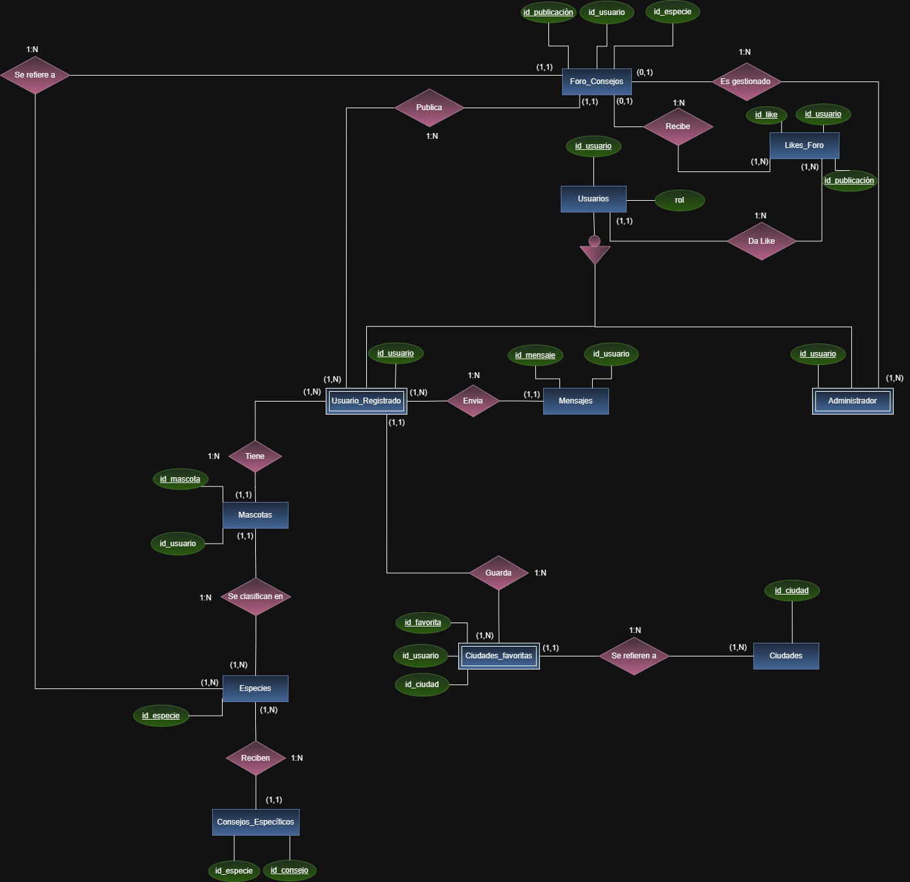

---

#### Modelo Relacional

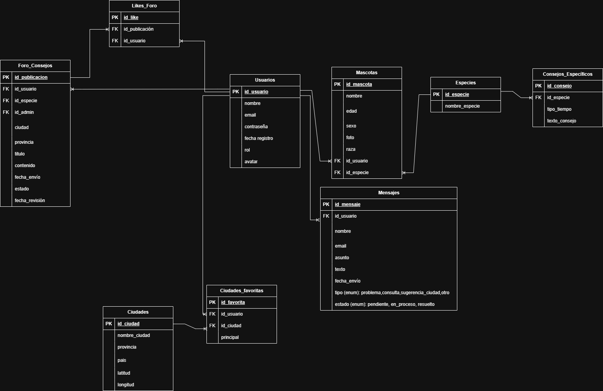

[⬆️ Volver al índice](#2-índice)